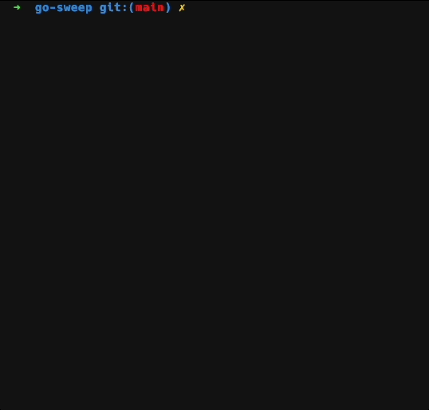

# go-sweep: Minesweeper in your terminal

I needed to learn go in preparation for advent of code this year, so I thought I would make one of my favorite games using go! I also wanted to learn how to make terminal UI apps, so I opted to use the [bubbletea tui framework](https://github.com/charmbracelet/bubbletea) to accomplish that. For future reference, this whole project took about 3 nights to accomplish.

## Demo

## To Run

1. `go build .`
2. `./go-sweep`

### Options

- `-w 30`: width of the minefield. default 30
- `-h 30`: height of the minefield. default 30
- `-n 90`: number of mines. default 99
- `-a`: use ascii character instead. by default, uses emojis to render cells

Please feel free to make an issue if you find any problems with the game! Sweep on!
